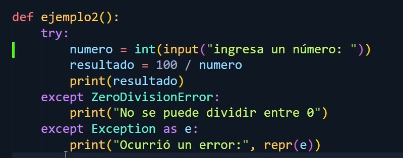

# Excepciones

## Introducción a las Excepciones
En Python, las excepciones son eventos que ocurren durante la ejecución de un programa y que interrumpen su flujo normal. Estos eventos suelen ser errores que impiden que el programa continúe, como intentar dividir un número por cero o acceder a un archivo que no existe. Python proporciona un mecanismo para manejar estos errores de manera controlada, permitiendo que el programa no se detenga abruptamente.

## ¿Qué es un Bloque Try-Except?
El bloque `try-except` es una estructura de control que permite manejar excepciones de manera efectiva. La idea básica es intentar ejecutar un bloque de código y, si ocurre una excepción, capturarla y realizar una acción alternativa. La sintaxis básica es la siguiente:

```
try:
    # Código que puede causar una excepción
except ExceptionType:
    # Código para manejar la excepción
```
Aquí, el bloque `try` contiene el código que puede generar una excepción, mientras que el bloque `except` contiene el código que se ejecuta si ocurre esa excepción.

## Manejo de Excepciones con Try-Except
El uso del bloque `try-except` es fundamental para gestionar los errores de manera controlada. A continuación, veremos cómo utilizarlo con ejemplos que capturan y manejan excepciones comunes.

#### Ejemplo 1: Manejo de ZeroDivisionError
```
try:
    resultado = 10 / 0
except ZeroDivisionError:
    print("Error: No se puede dividir por cero.")
```
En este ejemplo, intentamos dividir 10 entre 0, lo cual genera un ZeroDivisionError. Gracias al bloque `except`, capturamos la excepción y mostramos un mensaje de error en lugar de que el programa se detenga abruptamente.



#### Ejemplo 2: Manejo de FileNotFoundError
```
try:
    with open('archivo_no_existente.txt', 'r') as archivo:
        contenido = archivo.read()
except FileNotFoundError:
    print("Error: El archivo no existe.")
```
Aquí intentamos abrir un archivo que no existe, lo que produce un FileNotFoundError. La excepción se captura y se muestra un mensaje al usuario.

## Uso de Else y Finally en Excepciones
Además de los bloques `try` y `except`, Python ofrece las cláusulas `else` y `finally` para manejar excepciones de manera más completa y robusta.

### Bloque Else
El bloque `else` se ejecuta si el bloque `try` no genera ninguna excepción. Es útil para ejecutar código que debería correr solo si no hubo errores.
```
try:
    resultado = 10 / 2
except ZeroDivisionError:
    print("Error: No se puede dividir por cero.")
else:
    print("La operación fue exitosa, el resultado es:", resultado)
```
En este ejemplo, dado que no ocurre una excepción, se ejecuta el bloque else y se muestra el resultado de la operación.

### Bloque Finally
El bloque `finally` se ejecuta siempre, ocurra o no una excepción, lo que es útil para liberar recursos o realizar acciones de limpieza.
```
try:
    archivo = open('mi_archivo.txt', 'w')
    archivo.write("Hola, mundo!")
except IOError:
    print("Error: No se pudo escribir en el archivo.")
finally:
    archivo.close()
    print("El archivo ha sido cerrado.")
```
En este ejemplo, el bloque `finally` asegura que el archivo se cierre sin importar si ocurre una excepción o no.

## Excepciones Múltiples
En Python, es posible manejar múltiples excepciones en un solo bloque `try-except` utilizando diferentes cláusulas except para distintos tipos de errores. Esto permite manejar errores de manera específica y efectiva.

Ejemplo de Manejo de Múltiples Excepciones
```
try:
    valor = int(input("Ingresa un número: "))
    resultado = 10 / valor
except ValueError:
    print("Error: Debes ingresar un número.")
except ZeroDivisionError:
    print("Error: No se puede dividir por cero.")
```
En este ejemplo, capturamos dos tipos de excepciones: `ValueError`, que ocurre si el usuario ingresa algo que no es un número, y `ZeroDivisionError`, que ocurre si el usuario ingresa cero.

Ejemplo Detallado de Múltiples Excepciones
```
def procesar_archivo(nombre_archivo):
    try:
        with open(nombre_archivo, 'r') as archivo:
            contenido = archivo.read()
            numero = int(contenido.strip())
            resultado = 100 / numero
            print("El resultado es:", resultado)
    except FileNotFoundError:
        print("Error: El archivo no fue encontrado.")
    except ValueError:
        print("Error: El contenido del archivo no es un número válido.")
    except ZeroDivisionError:
        print("Error: El número en el archivo es cero, lo cual no es permitido.")

# Llamada a la función
procesar_archivo('datos.txt')
```
En este ejemplo más complejo, se manejan tres posibles excepciones diferentes:
- **FileNotFoundError**, si el archivo no existe.
- **ValueError**, si el contenido del archivo no puede convertirse en un número entero.
- **ZeroDivisionError**, si el número en el archivo es cero.

Cada excepción tiene su propio bloque `except`, lo que permite mensajes de error claros y específicos.

## Conclusión
El manejo de excepciones en Python es una habilidad esencial para escribir programas robustos y fiables. Al utilizar bloques `try-except`, los desarrolladores pueden anticipar y controlar los errores, mejorando así la experiencia del usuario y evitando que los programas se interrumpan de manera abrupta. El uso de las cláusulas `else` y `finally` permite una gestión aún más fina de los recursos y los flujos de trabajo, asegurando que el código funcione de manera eficiente incluso en situaciones imprevistas.

Finalmente, la capacidad de manejar múltiples excepciones en un solo bloque proporciona flexibilidad y control para responder de manera específica a una variedad de problemas, lo cual es crucial en el desarrollo de software de calidad.